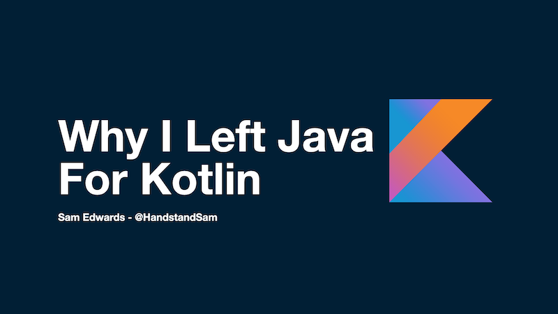

# Why I Left Java for Kotlin

## External Resources

* [Jake Wharton - Using Project Kotlin for Android (2015)](https://docs.google.com/document/d/1ReS3ep-hjxWA8kZi0YqDbEhCqTt29hG8P44aA9W0DM8/edit)
* [State of Kotlin 2018](https://pusher.com/state-of-kotlin)
* [Google's Guide for Adopting Kotlin on Large Teams](https://developer.android.com/kotlin/adopt-for-large-teams)
* [When You Should Use Null in Kotlin](https://handstandsam.com/2019/02/24/when-you-should-use-null-in-kotlin/)
* [Going Reactive with Spring, Coroutines and Kotlin Flow](https://spring.io/blog/2019/04/12/going-reactive-with-spring-coroutines-and-kotlin-flow)
